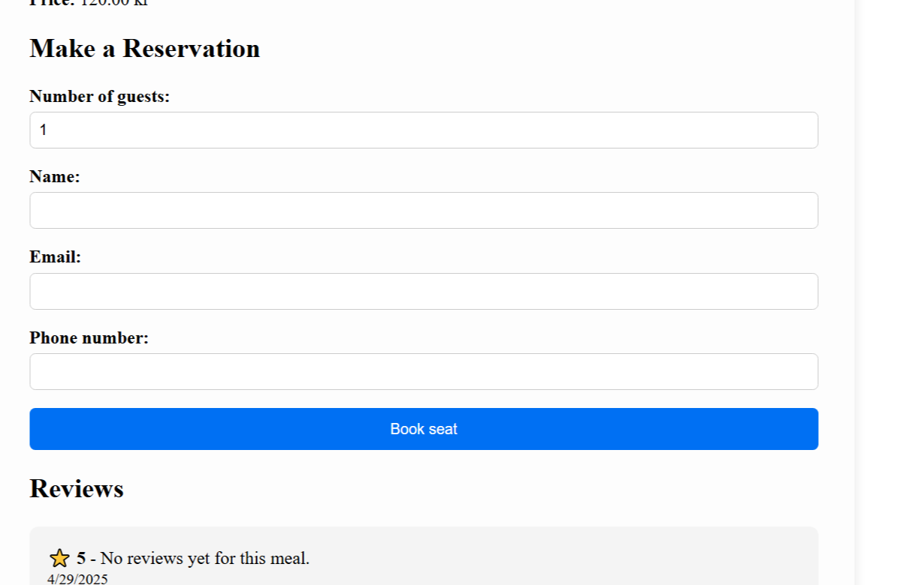

# Meal Sharing App

➡️ [Live App (Frontend)](https://meal-sharing-one.vercel.app/)  
➡️ [Live API (Backend)](https://meal-sharing-backend.up.railway.app)

---

## Description

Meal Sharing is a full-stack web application built using **TypeScript**, **Express.js**, **React**, and **PostgreSQL**.

This project was developed as an individual assignment for the **Hack Your Future Denmark** curriculum.

- The **frontend** is deployed on **Vercel**.
- The **backend** is deployed on **Railway**.

---

## Main Features

- 🍽️ Display meals from the database  
- 🔍 Search meals by name  
- 📝 Make reservations  
- ⭐ Leave reviews and star ratings  
- 📊 Sort meals based on price or available spots  

---

## Technologies Used

- **Frontend**:
  - React
  - Next.js
  - CSS Modules
  - JavaScript / TypeScript

- **Backend**:
  - Node.js
  - Express.js
  - Knex.js
  - PostgreSQL

---

## Backend

The backend is a RESTful API built with **Node.js**, **Express**, and **Mysql**, using **Knex.js** as a query builder.

### 🔗 Links

- 🔁 **API Endpoint (Production)**: [https://meal-sharing-backend.up.railway.app](https://meal-sharing-backend.up.railway.app)
- 💻 **Repository**: [https://github.com/najmeh25/meal-sharing-backend](https://github.com/najmeh25/meal-sharing-backend)

### 🚀 Run Backend Locally

```bash
# Clone the repo:
git clone https://github.com/najmeh25/meal-sharing.git
cd meal-sharing-backend.

# Install dependencies:
npm install

# Create a `.env` file with the following:
PORT=4000
DB_HOST=localhost
DB_USER=your_user
DB_PASSWORD=your_password
DB_NAME=meal_sharing

# Run database migrations (if using Knex)
npx knex migrate:latest

# Start the server
npm run dev
Once started, the backend will be running at:
📍 http://localhost:4000

What I Learned,During this project, I improved my skills in:
React component design (Star Rating, Modal, Forms),
API integration and HTTP requests,
PostgreSQL data modeling,
Express routing and REST API development,
Using Railway and Vercel for deployment,
Managing project tasks and debugging complex bugs.

Screenshots:
!

*Meals list displayed from the database*

  
*Reviews submitted by users*

Meals list displayed from the database
Users can submit reviews and star ratings

Deployment:
Frontend: Vercel
Backend: Railway

Author
👩 seyedeh najmeh Ghasemi
📧 Email: seyedehnajmeh25@gmail.com


License
This project is for educational purposes only as part of Hack Your Future curriculum.

